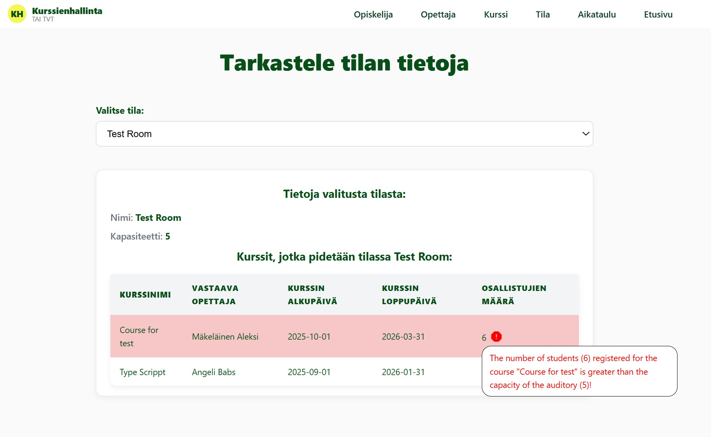
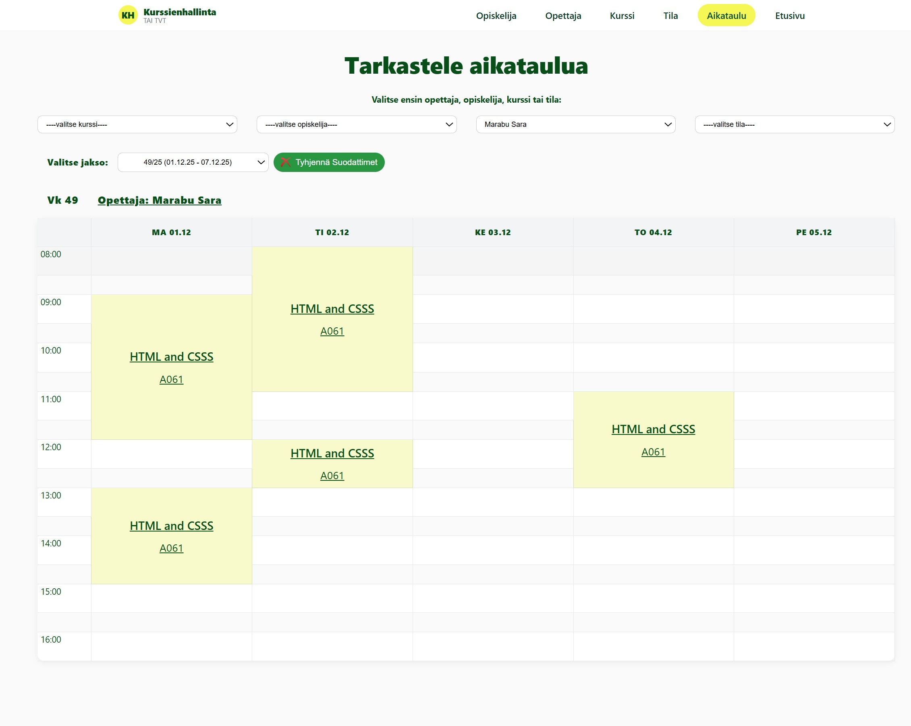

# Course Management System

## Project overview
Web-based course management system developed as an academic team project.
The application is designed to manage courses, students, teachers, classrooms, and schedules, as well as handle course registration.

The main goal of the project was to practice team-based web development, CRUD operations, and working with a relational database.

---

## Features
- Create, edit, and delete courses
- Manage students and teachers
- Course registration functionality
- Timetable and data overview pages
- Responsive layout for different screen sizes

---

## Tech stack
- HTML
- CSS
- JavaScript
- PHP
- SQL (MySQL)

---

## My role and contribution

Role: **Full-stack developer**

My responsibilities focused on project setup, backend functionality, and implementation of key user interface pages.

### Key contributions:

- Created and configured the GitHub repository
- Built the initial project structure
- Developed multiple database query functions
- Implemented the Room information page with dynamic data retrieval, capacity validation, and visual warnings for overbooked courses
- Developed the Course registration management page, including:
  * filtering functionality
  * pagination
  * group actions (edit/delete operations)
- Implemented the Schedule view page and designed the layout for student timetables
- Contributed to both frontend and backend development throughout the project

---

## Development process
- Team-based development
- Task-based workflow using feature branches
- Code integration via pull requests
- Versioned SQL database structure

---

## Running the project locally
This project requires a local PHP environment and a MySQL database.

Example setup:
- XAMPP
- Import one of the provided `.sql` files into MySQL
- Configure database connection in `connection.php`
- Run the project locally via `localhost`

The project is not deployed online and is intended for local development.

## Screenshots

### Home page

### Edit page example

### Get info page

### Warnings on the Get classroom info page

### Get timetable page

### Add page

---

## Notes
This repository represents an academic group project created for learning purposes.
It is not intended for production use.
